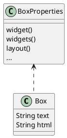
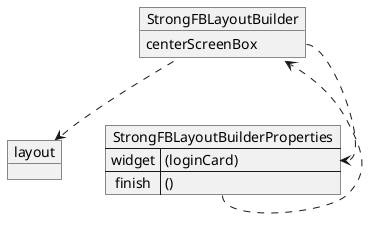
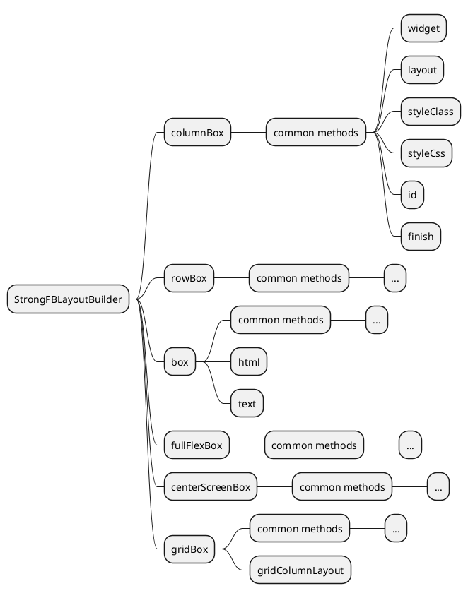

# Layouts

you can use some definitions of layouts like row flex box, column flex box, ...

every layout have common properties ( in sub class) and maybe have some special properties.

for example:



for layout of a simple form:

```ts
override get layout() {
    return this.layoutBuilder().centerScreenBox().widget(this.loginCard).finish();
}
```



## `StrongFBLayoutBuilder` schema

